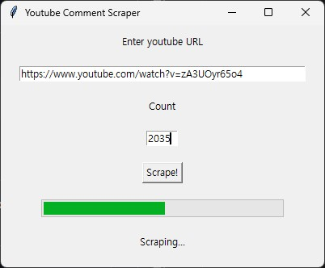
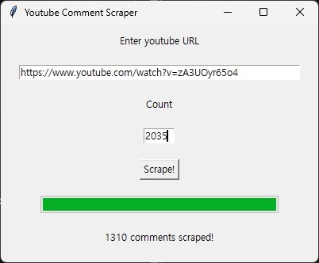

# NLP Individual Project
This repository is for the Natural Language Processing and Information Retrieval cource, providing a Youtube comments corpus and a scraper for collecting them.

# Requirements
Install the required packages: [youtube comment downloader](https://github.com/egbertbouman/youtube-comment-downloader)
```bash
pip install -r requirements.txt
```

# Corpus
The corpus provided in the corpus folder consists of comments from the 1st, 2nd, and 4th most trending videos on Korean Youtube as of March 16, 2025, at 16:23 KST. The videos are as follows:
| Video ID | txt File | Number of comments | Video |
|:-------:|:-------:|:-------:|:-------:|
| Dz77zxY3NJE | youtube-comments-Dz77zxY3NJE.txt | 1289 | [정원 딸린 '제니 사무실' 세계 최초 공개한 홍진경 (제니 엄마 전화연결)](https://www.youtube.com/watch?v=Dz77zxY3NJE) |
| 6YPrbka9YoA | youtube-comments-6YPrbka9YoA.txt | 1995 | [글로벌 진출은 핑계고ㅣEP.72](https://www.youtube.com/watch?v=6YPrbka9YoA) |
| Svj1pTrGHZM | youtube-comments-Svj1pTrGHZM.txt | 1257 | [[#미스터트롯3] 어린 시절 나의 세상이었던 할머니에게.. 결승전 김용빈의 인생곡 '감사'♬ #TVCHOSUNMUSIC (TV CHOSUN 250313 방송)](https://www.youtube.com/watch?v=Svj1pTrGHZM) |

# How to use
You can simply run the scraper with the following code:
```bash
python scraper.py
```

  
When you run the scraper, a Tkinter window like the one above will appear.
1. Enter YouTube URL: Input the URL of the YouTube video in the desingated field.
2. Enter Count: Specify the number of comments you want to scrape. If you enter a number greater than the available comments, the scraper will collect all possible comments and then complete the process. It is recommended to enter the number of comments displayed on the YouTube site (since not all commnents may be accessible, the scraper will typically extract as many as possible in such cases).
3. Click the Scrape Button: The scraping process will begin, proceeding as shown below.
   


