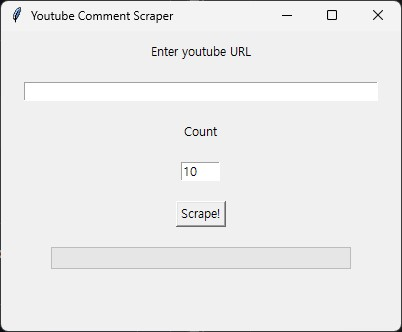

# IR Individual Project
This repository is for the Natural Language Processing and Information Retrieval cource, providing a Youtube comments corpus and a scraper for collecting them.

# Requirements
Install the required packages: [youtube comment downloader](https://github.com/egbertbouman/youtube-comment-downloader)
```bash
pip install -r requirements.txt
```

# Corpus
The corpus provided in the corpus folder consists of comments from the top 10 most trending videos in game category on Korean Youtube as of March 20, 2025, at 16:00 KST. The videos are as follows:
| Video ID | txt File | Number of comments | Video |
|:-------:|:-------:|:-------:|:-------:|
| NWbrdLM4sH8 | youtube-comments-NWbrdLM4sH8.txt | 264 | [사람 미치게 하는 게임](https://www.youtube.com/watch?v=NWbrdLM4sH8) |
| B4jVN291muc | youtube-comments-B4jVN291muc.txt | 266 | [왜 항상 강타가 없어요?ㅋㅋㅋ 이팀은 상호만 미워해ㅋㅋㅋ](https://www.youtube.com/watch?v=B4jVN291muc) |
| 8O7cF6el9TQ | youtube-comments-8O7cF6el9TQ.txt | 213 | [혼을 담은 구라](https://www.youtube.com/watch?v=8O7cF6el9TQ) |
| 4PJSXk0Dyrw | youtube-comments-4PJSXk0Dyrw.txt | 401 | [귀여운 리썰컴퍼니](https://www.youtube.com/watch?v=4PJSXk0Dyrw) |
| Kww20gXf75s | youtube-comments-Kww20gXf75s.txt | 208 | [반바스텐이랑 다 조지러 갈게요 ^^ 첫 인상은..?!](https://www.youtube.com/watch?v=Kww20gXf75s) |
| 3abg06YflyM | youtube-comments-3abg06YflyM.txt | 181 | [칸 계속 솔킬내는 멸망전의 김민교ㅋㅋㅋㅋ](https://www.youtube.com/watch?v=3abg06YflyM) |
| UN9kBoL1tik | youtube-comments-UN9kBoL1tik.txt | 529 | [고장난 놀이기구 점검 중에... 무언가 움직였다?](https://www.youtube.com/watch?v=UN9kBoL1tik) |
| 1iom8CdJvQ8 | youtube-comments-1iom8CdJvQ8&.txt | 746 | [드디어 배틀그라운드 언리얼5 영상공개..!! 소름 돋았습니다 솔직히 이 정도일 줄은 ㄷㄷ..](https://www.youtube.com/watch?v=1iom8CdJvQ8) |
| AzZbVF6vlMU | youtube-comments-AzZbVF6vlMU.txt | 174 | [계왕권 쓴거 아닙니다;;](https://www.youtube.com/watch?v=AzZbVF6vlMU) |
| Lj0-AOJfeUw | youtube-comments-Lj0-AOJfeUw.txt | 71 | [ 초밥에 들어가기도전에 역대급 레전드 상황 발생 ㅋㅋㅋㅋㅋ](https://www.youtube.com/watch?v=Lj0-AOJfeUw) |

# How to use
You can simply run the scraper with the following code:
```bash
python scraper.py
```

  
When you run the scraper, a Tkinter window like the one above will appear.
1. Enter YouTube URL: Input the URL of the YouTube video in the desingated field.
2. Enter Count: Specify the number of comments you want to scrape. If you enter a number greater than the available comments, the scraper will collect all possible comments and then complete the process. It is recommended to enter the number of comments displayed on the YouTube site (since not all commnents may be accessible, the scraper will typically extract as many as possible in such cases).
3. Click the Scrape Button: The scraping process will begin, proceeding as shown below.
   


